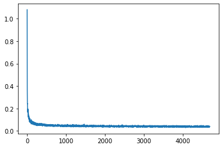
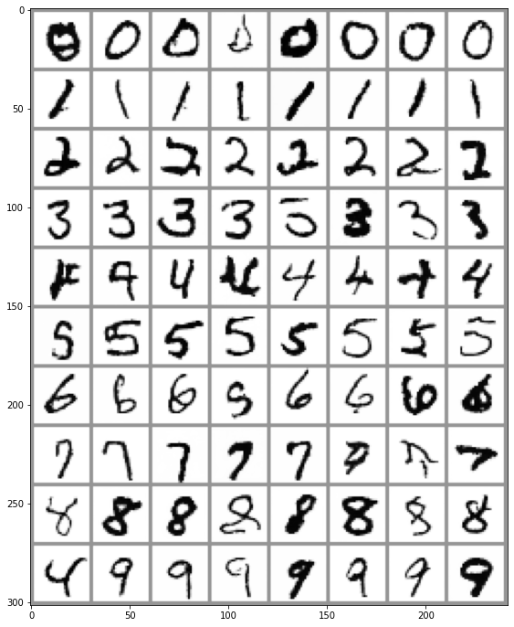

# 创建一个类别条件扩散模型

在这节笔记本中，我们将阐述一种给扩散模型加条件信息的方法。具体来说，我们将接着[这个从头训练的例子](../unit1/02_diffusion_models_from_scratch_CN.ipynb)在 MNIST 上训练一个以类别为条件的扩散模型。这里我们可以在推理时指定我们要生成的是哪个数字。

就像本单元介绍中说的那样，这只是很多给扩散模型添加额外条件信息的方法中的一种，这里用它做示例是因为它比较简单。就像第一单元中“从走训练”的例子一样，这节笔记本也是为了解释说明的目的。如果你想，你也可以安全地跳过本节。

## 配置和数据准备


```python
!pip install -q diffusers
```

         |████████████████████████████████| 503 kB 7.2 MB/s 
         |████████████████████████████████| 182 kB 51.3 MB/s 
    [?25h


```python
import torch
import torchvision
from torch import nn
from torch.nn import functional as F
from torch.utils.data import DataLoader
from diffusers import DDPMScheduler, UNet2DModel
from matplotlib import pyplot as plt
from tqdm.auto import tqdm

device = 'mps' if torch.backends.mps.is_available() else 'cuda' if torch.cuda.is_available() else 'cpu'
print(f'Using device: {device}')
```

    Using device: cuda


```python
# Load the dataset
dataset = torchvision.datasets.MNIST(root="mnist/", train=True, download=True, transform=torchvision.transforms.ToTensor())

# Feed it into a dataloader (batch size 8 here just for demo)
train_dataloader = DataLoader(dataset, batch_size=8, shuffle=True)

# View some examples
x, y = next(iter(train_dataloader))
print('Input shape:', x.shape)
print('Labels:', y)
plt.imshow(torchvision.utils.make_grid(x)[0], cmap='Greys');
```

    Downloading http://yann.lecun.com/exdb/mnist/train-images-idx3-ubyte.gz
    Downloading http://yann.lecun.com/exdb/mnist/train-images-idx3-ubyte.gz to mnist/MNIST/raw/train-images-idx3-ubyte.gz


      0%|          | 0/9912422 [00:00<?, ?it/s]


    Extracting mnist/MNIST/raw/train-images-idx3-ubyte.gz to mnist/MNIST/raw
    
    Downloading http://yann.lecun.com/exdb/mnist/train-labels-idx1-ubyte.gz
    Downloading http://yann.lecun.com/exdb/mnist/train-labels-idx1-ubyte.gz to mnist/MNIST/raw/train-labels-idx1-ubyte.gz


      0%|          | 0/28881 [00:00<?, ?it/s]


    Extracting mnist/MNIST/raw/train-labels-idx1-ubyte.gz to mnist/MNIST/raw
    
    Downloading http://yann.lecun.com/exdb/mnist/t10k-images-idx3-ubyte.gz
    Downloading http://yann.lecun.com/exdb/mnist/t10k-images-idx3-ubyte.gz to mnist/MNIST/raw/t10k-images-idx3-ubyte.gz


      0%|          | 0/1648877 [00:00<?, ?it/s]


    Extracting mnist/MNIST/raw/t10k-images-idx3-ubyte.gz to mnist/MNIST/raw
    
    Downloading http://yann.lecun.com/exdb/mnist/t10k-labels-idx1-ubyte.gz
    Downloading http://yann.lecun.com/exdb/mnist/t10k-labels-idx1-ubyte.gz to mnist/MNIST/raw/t10k-labels-idx1-ubyte.gz


      0%|          | 0/4542 [00:00<?, ?it/s]


    Extracting mnist/MNIST/raw/t10k-labels-idx1-ubyte.gz to mnist/MNIST/raw
    
    Input shape: torch.Size([8, 1, 28, 28])
    Labels: tensor([8, 1, 5, 9, 7, 6, 2, 2])


    

    


## 创建一个以类别为条件的 UNet

我们输入类别这一条件的方法是：
- 创建一个标准的 `UNet2DModel`，加入一些额外的输入通道
- 通过一个嵌入层，把类别标签映射到一个 `(class_emb_size)` 形状的学到的向量上
- 把这个信息作为额外通道和原有的输入向量拼接起来，用这行代码：`net_input = torch.cat((x, class_cond), 1)`
- 把这个 `net_input` (有 `class_emb_size+1` 个通道)输入到UNet中得到最终预测

在这个例子中，我把 class_emb_size 设成4，但这其实是可以任意修改的，你可以试试从把它设成1（你可以看看这有没有用）到把它设成 10（正好是类别总数），或者把需要学到的 nn.Embedding 换成简单的对类别进行独热编码(one-hot encoding）。

具体实现起来就是这样：


```python
class ClassConditionedUnet(nn.Module):
  def __init__(self, num_classes=10, class_emb_size=4):
    super().__init__()
    
    # The embedding layer will map the class label to a vector of size class_emb_size
    self.class_emb = nn.Embedding(num_classes, class_emb_size)

    # Self.model is an unconditional UNet with extra input channels to accept the conditioning information (the class embedding)
    self.model = UNet2DModel(
        sample_size=28,           # the target image resolution
        in_channels=1 + class_emb_size, # Additional input channels for class cond.
        out_channels=1,           # the number of output channels
        layers_per_block=2,       # how many ResNet layers to use per UNet block
        block_out_channels=(32, 64, 64), 
        down_block_types=( 
            "DownBlock2D",        # a regular ResNet downsampling block
            "AttnDownBlock2D",    # a ResNet downsampling block with spatial self-attention
            "AttnDownBlock2D",
        ), 
        up_block_types=(
            "AttnUpBlock2D", 
            "AttnUpBlock2D",      # a ResNet upsampling block with spatial self-attention
            "UpBlock2D",          # a regular ResNet upsampling block
          ),
    )

  # Our forward method now takes the class labels as an additional argument
  def forward(self, x, t, class_labels):
    # Shape of x:
    bs, ch, w, h = x.shape
    
    # class conditioning in right shape to add as additional input channels
    class_cond = self.class_emb(class_labels) # Map to embedding dinemsion
    class_cond = class_cond.view(bs, class_cond.shape[1], 1, 1).expand(bs, class_cond.shape[1], w, h)
    # x is shape (bs, 1, 28, 28) and class_cond is now (bs, 4, 28, 28)

    # Net input is now x and class cond concatenated together along dimension 1
    net_input = torch.cat((x, class_cond), 1) # (bs, 5, 28, 28)

    # Feed this to the unet alongside the timestep and return the prediction
    return self.model(net_input, t).sample # (bs, 1, 28, 28)
```

如果你对任何的张量形状或变换感到迷惑，你都可以在代码中加入print来看看相关形状，检查一下是不是和你预设的是一致的。这里我把一些中间变量的形状都注释上了，希望能帮你思路清晰点。

## 训练和采样

不同于别的地方使用的`prediction = unet(x, t)`，这里我们使用`prediction = unet(x, t, y)`，在训练时把正确的标签作为第三个输入送到模型中。在推理阶段，我们可以输入任何我们想要的标签，如果一切正常，那模型就会输出与之匹配的图片。`y`在这里时 MNIST 中的数字标签，值的范围从0到9。

这里的训练循环很像[第一单元的例子](../unit1/02_diffusion_models_from_scratch_CN.ipynb)。我们这里预测的是噪声（而不是像第一单元的去噪图片），以此来匹配 DDPMScheduler 预计的目标。这里我们用 DDPMScheduler 来在训练中加噪声，并在推理时采样用。训练也需要一段时间 —— 如何加速训练也可以是个有趣的小项目。但你也可以跳过运行代码（甚至整节笔记本），因为我们这里纯粹是在讲解思路。


```python
# Create a scheduler
noise_scheduler = DDPMScheduler(num_train_timesteps=1000, beta_schedule='squaredcos_cap_v2')
```


```python
#@markdown Training loop (10 Epochs):

# Redefining the dataloader to set the batch size higher than the demo of 8
train_dataloader = DataLoader(dataset, batch_size=128, shuffle=True)

# How many runs through the data should we do?
n_epochs = 10

# Our network 
net = ClassConditionedUnet().to(device)

# Our loss finction
loss_fn = nn.MSELoss()

# The optimizer
opt = torch.optim.Adam(net.parameters(), lr=1e-3) 

# Keeping a record of the losses for later viewing
losses = []

# The training loop
for epoch in range(n_epochs):
    for x, y in tqdm(train_dataloader):
        
        # Get some data and prepare the corrupted version
        x = x.to(device) * 2 - 1 # Data on the GPU (mapped to (-1, 1))
        y = y.to(device)
        noise = torch.randn_like(x)
        timesteps = torch.randint(0, 999, (x.shape[0],)).long().to(device)
        noisy_x = noise_scheduler.add_noise(x, noise, timesteps)

        # Get the model prediction
        pred = net(noisy_x, timesteps, y) # Note that we pass in the labels y

        # Calculate the loss
        loss = loss_fn(pred, noise) # How close is the output to the noise

        # Backprop and update the params:
        opt.zero_grad()
        loss.backward()
        opt.step()

        # Store the loss for later
        losses.append(loss.item())

    # Print our the average of the last 100 loss values to get an idea of progress:
    avg_loss = sum(losses[-100:])/100
    print(f'Finished epoch {epoch}. Average of the last 100 loss values: {avg_loss:05f}')

# View the loss curve
plt.plot(losses)
```


      0%|          | 0/469 [00:00<?, ?it/s]


    Finished epoch 0. Average of the last 100 loss values: 0.052451


      0%|          | 0/469 [00:00<?, ?it/s]


    Finished epoch 1. Average of the last 100 loss values: 0.045999


      0%|          | 0/469 [00:00<?, ?it/s]


    Finished epoch 2. Average of the last 100 loss values: 0.043344


      0%|          | 0/469 [00:00<?, ?it/s]


    Finished epoch 3. Average of the last 100 loss values: 0.042347


      0%|          | 0/469 [00:00<?, ?it/s]


    Finished epoch 4. Average of the last 100 loss values: 0.041174


      0%|          | 0/469 [00:00<?, ?it/s]


    Finished epoch 5. Average of the last 100 loss values: 0.040736


      0%|          | 0/469 [00:00<?, ?it/s]


    Finished epoch 6. Average of the last 100 loss values: 0.040386


      0%|          | 0/469 [00:00<?, ?it/s]


    Finished epoch 7. Average of the last 100 loss values: 0.039372


      0%|          | 0/469 [00:00<?, ?it/s]


    Finished epoch 8. Average of the last 100 loss values: 0.039056


      0%|          | 0/469 [00:00<?, ?it/s]


    Finished epoch 9. Average of the last 100 loss values: 0.039024


    [<matplotlib.lines.Line2D>]


    

    


一旦训练结束，我们就可以通过输入不同的标签作为条件，来采样图片了：


```python
#@markdown Sampling some different digits:

# Prepare random x to start from, plus some desired labels y
x = torch.randn(80, 1, 28, 28).to(device)
y = torch.tensor([[i]*8 for i in range(10)]).flatten().to(device)

# Sampling loop
for i, t in tqdm(enumerate(noise_scheduler.timesteps)):

    # Get model pred
    with torch.no_grad():
        residual = net(x, t, y)  # Again, note that we pass in our labels y

    # Update sample with step
    x = noise_scheduler.step(residual, t, x).prev_sample

# Show the results
fig, ax = plt.subplots(1, 1, figsize=(12, 12))
ax.imshow(torchvision.utils.make_grid(x.detach().cpu().clip(-1, 1), nrow=8)[0], cmap='Greys')
```


    0it [00:00, ?it/s]


    <matplotlib.image.AxesImage>


    

    


就是这么简单！我们现在已经对要生成的图片有所控制了。

希望你喜欢这个例子。一如既往地，如果你有问题，你随时可以在 Discord 上提出来。


```python
# 练习（选做）：用同样方法在 FashionMNIST 数据集上试试。调节学习率、batch size 和训练的轮数（epochs）。
# 你能用比例子更少的训练时间得到些看起来不错的时尚相关的图片吗？
```
